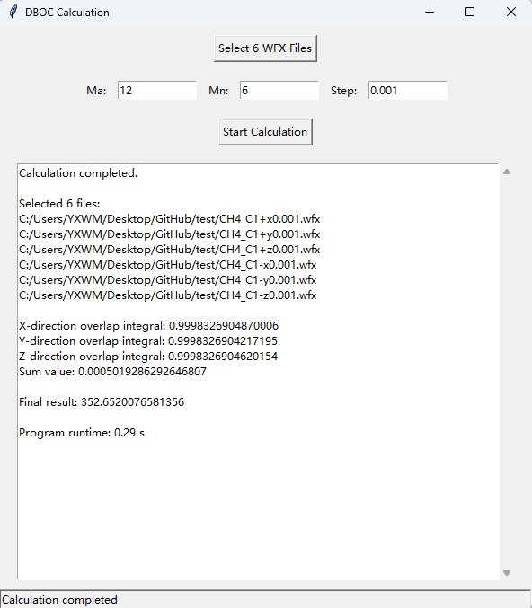

# DBOC GUI Calculator

## Overview

The **DBOC GUI Calculator** is a graphical research tool for evaluating the **Diagonal Born–Oppenheimer Correction (DBOC)** using a finite-difference strategy based on wavefunction overlap analysis.

This software is designed for post-processing **Gaussian-generated** wavefunction files in `.wfx` format. It requires six wavefunction files corresponding to finite displacements of atomic coordinates along the positive and negative directions of the three Cartesian axes. Based on these inputs, the software constructs primitive Gaussian basis information, evaluates atomic and molecular orbital overlap quantities, and computes the final DBOC-related value.

The graphical user interface is implemented in **Tkinter**, allowing convenient file selection, parameter input, and result visualization.

---

## Main Functions

- Graphical user interface for DBOC-related finite-difference calculations
- Automatic recognition and assignment of six displaced `.wfx` files
- Parsing of Gaussian-generated WFX wavefunction data
- Construction of primitive Gaussian basis representations
- Evaluation of atomic orbital overlap matrices
- Evaluation of molecular orbital overlap quantities
- Output of the final DBOC-related result and runtime information

---

## System Requirements

- Python 3.9 or higher
- NumPy

Install the required dependency with:

```bash
pip install -r requirements.txt
````

---

## Project Structure

```text
DBOC-gui/
├─ main.py
├─ gui.py
├─ wfx_parser.py
├─ overlap_calc.py
├─ constants.py
├─ README.md
├─ requirements.txt
├─ .gitignore
├─ LICENSE
├─ example_data/
   ├─ CH4_C1+x0.001.wfx
   ├─ CH4_C1-x0.001.wfx
   ├─ CH4_C1+y0.001.wfx
   ├─ CH4_C1-y0.001.wfx
   ├─ CH4_C1+z0.001.wfx
   └─ CH4_C1-z0.001.wfx
└─ screenshots/
   └─ gui_example.png
```

---

## Running the Program

Launch the program with:

```bash
python main.py
```

After execution, the graphical user interface will open.

---

## Graphical Interface

The program provides a Tkinter-based graphical user interface for selecting six WFX files, entering the required physical parameters (`Ma`, `Mn`, and `Step`), and viewing the calculated overlap quantities and final DBOC-related result.



## Input Data

This software requires **six** Gaussian-generated wavefunction files with the `.wfx` extension.

These files must correspond to finite displacements of atomic coordinates along the Cartesian directions:

* `+x`
* `-x`
* `+y`
* `-y`
* `+z`
* `-z`

The program automatically assigns the selected files according to these directional labels contained in the filenames.

### Example filenames

* `molecule+x0.001.wfx`
* `molecule-x0.001.wfx`
* `molecule+y0.001.wfx`
* `molecule-y0.001.wfx`
* `molecule+z0.001.wfx`
* `molecule-z0.001.wfx`

To ensure correct file assignment, the displacement labels must be clearly present in the filenames.

---

## Input Parameters

Before starting the calculation, the following parameters must be provided in the graphical interface:

* **Ma**: relative atomic mass
* **Mn**: nuclear mass
* **Step**: finite-difference displacement step size

All parameter values must be entered in valid numerical format.

---

## Usage Instructions

1. Start the program:

   ```bash
   python main.py
   ```

2. Click **Select 6 WFX Files** in the GUI.

3. Select the six displaced `.wfx` files generated by Gaussian.

   * On Windows or Linux, hold **CTRL** to select multiple files.
   * All six files should be selected in a single operation.

4. Ensure that the selected files correspond to the six required displacement directions:

   * `+x`
   * `-x`
   * `+y`
   * `-y`
   * `+z`
   * `-z`

5. Enter the required parameters:

   * **Ma** (relative atomic mass)
   * **Mn** (nuclear mass)
   * **Step** (finite-difference step size)

6. Click **Start Calculation**.

7. The program will then automatically:

   * read and parse the six WFX files
   * construct primitive Gaussian basis information
   * compute atomic orbital overlap matrices
   * compute molecular orbital overlap quantities
   * evaluate the final DBOC-related result

8. The calculation results will be displayed in the result panel.

---

## Output

The result panel displays:

* the selected input files
* X-direction overlap quantity
* Y-direction overlap quantity
* Z-direction overlap quantity
* summed overlap-related value
* final DBOC-related result
* total runtime

---

## Example

The following example uses six displaced WFX files for methane (`CH4`) with displacement applied to the carbon atom:

* `example_data/CH4_C1+x0.001.wfx`
* `example_data/CH4_C1-x0.001.wfx`
* `example_data/CH4_C1+y0.001.wfx`
* `example_data/CH4_C1-y0.001.wfx`
* `example_data/CH4_C1+z0.001.wfx`
* `example_data/CH4_C1-z0.001.wfx`

### Input parameters

* **Ma** = 12
* **Mn** = 6
* **Step** = 0.001

### Example output

```text
Calculation completed.

Selected 6 files:
example_data/CH4_C1+x0.001.wfx
example_data/CH4_C1+y0.001.wfx
example_data/CH4_C1+z0.001.wfx
example_data/CH4_C1-x0.001.wfx
example_data/CH4_C1-y0.001.wfx
example_data/CH4_C1-z0.001.wfx

X-direction overlap integral: 0.9998326904870006
Y-direction overlap integral: 0.9998326904217195
Z-direction overlap integral: 0.9998326904620154
Sum value: 0.0005019286292646807

Final result: 352.6520076581356

Program runtime: 0.29 s
```

---

## Scientific Scope and Notes

This software is intended for **research and academic use**.

The reliability of the result depends on the consistency of the input wavefunction files and the finite-displacement scheme used to generate them. Therefore:

* all six `.wfx` files should be produced in a consistent computational workflow
* the displacement step size should match the value entered in the GUI
* file naming must preserve the displacement-direction labels for automatic recognition
* all six files must be selected before the calculation begins

This version is designed as a GUI-based research utility. It may be further extended in the future for command-line execution, batch processing, or automated workflows.

---

## Citation

If you use this software in your research, please cite the following article:

Yixi W, Zhang Y, Liu Y. *Accurate Estimation of the Diagonal Born-Oppenheimer Corrections of Hydrogen-Bearing Molecules: The Comparison of Different Density Functional Methods*. **J Phys Chem A.** 2025;129(50):11713-11724. doi:10.1021/acs.jpca.5c05438

---

## Possible Future Development

Potential future improvements include:

* command-line mode
* batch calculation support
* export of results to text or CSV files
* improved validation for malformed WFX files
* unit tests for parsing and overlap calculations
* clearer separation between computational backend and GUI frontend

---

## License

This project is distributed under the MIT License. See the `LICENSE` file for details.
